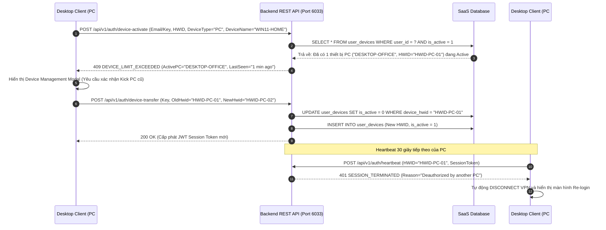

# SAAS LICENSING & HARDWARE FINGERPRINTING (HWID) ENFORCEMENT SPECIFICATION (V2.1)
================================================================================
Dự án: NextAI VPN Platform & Residential Gateway Mesh
Thương hiệu: `nextaitechnology` | Package: `com.nextaitechnology.vpn`
================================================================================

## 1. TỔNG QUAN (OVERVIEW)

Tài liệu này quy định chi tiết kiến trúc bản quyền SaaS, cơ chế thu thập dấu vân tay phần cứng (Hardware Fingerprint - HWID), ràng buộc số lượng thiết bị nghiêm ngặt (**Tối đa 1 PC + 1 Mobile** trên mỗi gói cá nhân/Pro), cơ chế kiểm tra phiên song song (Concurrent Heartbeat) và chống chia sẻ tài khoản bất hợp pháp (Anti-Account Sharing).

---

## 2. QUY TẮC PHÂN BỔ THIẾT BỊ (DEVICE LIMIT LAWS)

1. **Gói Standard / Pro (Individual Plan)**:
   - **Slot 1**: Tối đa **1 thiết bị loại PC** (Windows Desktop / macOS / Linux).
   - **Slot 2**: Tối đa **1 thiết bị loại Mobile** (Android / iOS).
   - **Tổng cộng**: Tối đa **2 thiết bị** đồng thời.
2. **Chặn Chia Sẻ Tài Khoản (Anti-Sharing Enforcement)**:
   - 1 Email hoặc 1 License Key **KHÔNG THỂ** kích hoạt trên 2 máy tính PC hoặc 2 điện thoại Mobile cùng một thời điểm.
   - Nếu người dùng đăng nhập trên một máy tính PC mới (PC #2) trong khi PC #1 đang hoạt động:
     * Máy chủ Backend từ chối kích hoạt với mã lỗi: `409 DEVICE_LIMIT_EXCEEDED`.
     * Giao diện hiển thị hộp thoại: *"Tài khoản đã đạt giới hạn 1 PC. Bạn có muốn Đăng xuất và Hủy liên kết máy cũ ('DESKTOP-WIN11-OFFICE') để chuyển bản quyền sang máy này không?"*
     * Khi người dùng xác nhận chuyển đổi -> PC #1 bị ngắt kết nối (Force Disconnect) ngay lập tức.
3. **Gói Doanh Nghiệp (Team / Enterprise Multi-Seat)**:
   - Cho phép mở rộng theo số lượng Seat (ví dụ: Gói 5 Seats = 5 PC + 5 Mobile).

---

## 3. THUẬT TOÁN TẠO DẤU VÂN TAY PHẦN CỨNG (HWID ALGORITHM)

### A. Dành cho Windows Desktop (.NET 10 WPF Client)
Thu thập các thông số phần cứng cố định từ WMI (Windows Management Instrumentation) và BIOS:
1. `ProcessorId`: ID vi xử lý từ `Win32_Processor`.
2. `MotherboardSerial`: Số sê-ri bo mạch chủ từ `Win32_BaseBoard`.
3. `BiosUuid`: UUID của bo mạch / BIOS từ `Win32_ComputerSystemProduct.UUID`.
4. `PrimaryMac`: Địa chỉ MAC của card mạng vật lý chính từ `Win32_NetworkAdapterConfiguration`.

```csharp
// Thuật toán tạo HWID trên C# .NET 10
public static string GenerateHwid()
{
    string cpuId = GetWmiProperty("Win32_Processor", "ProcessorId");
    string mbSerial = GetWmiProperty("Win32_BaseBoard", "SerialNumber");
    string biosUuid = GetWmiProperty("Win32_ComputerSystemProduct", "UUID");
    string macAddress = GetPrimaryMacAddress();

    string rawFingerprint = $"{cpuId}|{mbSerial}|{biosUuid}|{macAddress}";
    using var sha256 = System.Security.Cryptography.SHA256.Create();
    byte[] hash = sha256.ComputeHash(System.Text.Encoding.UTF8.GetBytes(rawFingerprint));
    string hexHash = Convert.ToHexString(hash);

    // Chuẩn hóa định dạng: HWID-PC-WIN11-XXXX-XXXX-XXXX
    return $"HWID-PC-WIN11-{hexHash.Substring(0, 4)}-{hexHash.Substring(4, 4)}-{hexHash.Substring(8, 4)}";
}
```

### B. Dành cho Android Mobile Client
Thu thập kết hợp:
1. `Settings.Secure.ANDROID_ID`: Định dạng 64-bit hex bất biến theo chữ ký ứng dụng.
2. `MediaDrm.PROPERTY_DEVICE_UNIQUE_ID`: ID phần cứng DRM Widevine cấp phần cứng.
3. `Build.FINGERPRINT`: Thông số bản dựng thiết bị OEM.

```
Định dạng: MOB-ANDROID-A8F2-3C91-0045
```

### C. Dành cho iOS Mobile Client
Sử dụng `UIDevice.current.identifierForVendor.uuidString` kết hợp Keychain lưu trữ khóa mã hóa phần cứng.

```
Định dạng: MOB-IOS-7E21-B890-44AA
```

---

## 4. QUY TRÌNH XÁC THỰC & PHIÊN SONG SONG (CONCURRENT HEARTBEAT WORKFLOW)



---

## 5. BẢNG CONTRACT API (SWAGGER / OPENAPI)

| Endpoint | Method | Chức năng | Body Payload | Phản hồi |
| :--- | :---: | :--- | :--- | :--- |
| `/api/v1/auth/device-activate` | POST | Kích hoạt thiết bị kèm kiểm tra HWID | `{ email, license_key, hwid, device_type, device_name, os_version }` | `200 OK` hoặc `409 DEVICE_LIMIT_EXCEEDED` |
| `/api/v1/auth/device-transfer` | POST | Hủy liên kết máy cũ & cấp quyền máy mới | `{ license_key, old_hwid, new_hwid, confirm: true }` | `200 OK { token, expires_at }` |
| `/api/v1/auth/heartbeat` | POST | Heartbeat định kỳ 30s kiểm tra tính hợp lệ | `{ hwid, session_token, ping_stats, bandwidth_used }` | `200 OK { status: "ACTIVE", quota_remaining_mb }` |
| `/api/v1/user/devices` | GET | Lấy danh sách thiết bị đang gắn với tài khoản | Header: `Authorization: Bearer <token>` | `200 OK { max_pc: 1, max_mobile: 1, devices: [...] }` |
| `/api/v1/user/devices/kick` | POST | Hủy liên kết thiết bị cụ thể từ Web/App | `{ target_hwid }` | `200 OK { unlinked: true }` |

---

## 6. HỆ THỐNG PHÁT HIỆN GIAN LẬN (ANTI-SHARING FRAUD DETECTION)

1. **Phát hiện Đa Địa Lý Đồng Thời (Concurrent Multi-GEO Alert)**:
   - Nếu 1 tài khoản gửi request từ 2 dải IP có khoảng cách địa lý > 500km trong vòng 5 phút (ví dụ: vừa từ Hà Nội vừa từ New York) -> Hệ thống tự động khóa tạm thời và gửi email xác minh OTP.
2. **Giới hạn Số Lần Đổi Máy (HWID Transfer Rate Limit)**:
   - Mỗi License cá nhân chỉ được đổi máy (Transfer HWID) tối đa **3 lần / 30 ngày** để ngăn chặn hành vi xoay vòng bán lại key.
   - Vượt quá 3 lần -> Bắt buộc liên hệ bộ phận hỗ trợ (Support Ticket).
